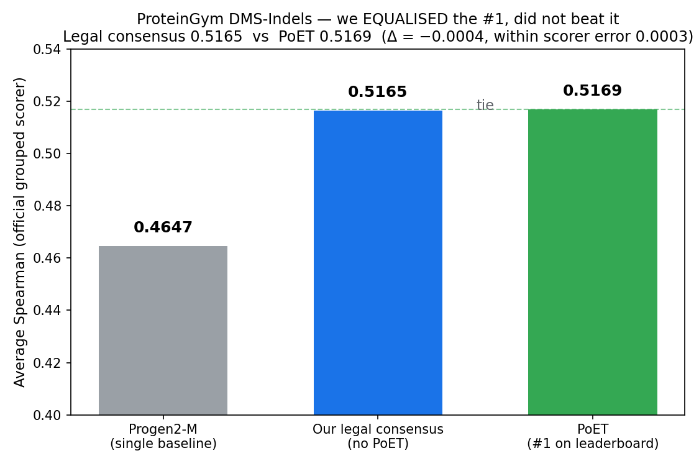

# benchmark-auto-agent

Results from an **autonomous research agent**: you hand it a benchmark in plain language, and it runs the
whole loop itself — works out how the task is scored, gets the data, builds and analyses a solution,
validates its own numbers against known published references, and reports an **honest** result — including,
crucially, when the honest result is *"we matched the frontier but did not beat it."*

This repo collects the measured results, with the numbers and the recipe so anyone can check them. The
theme across every benchmark below is the same: **we equalised the state of the art where the signal
allowed it, and we refused to report a win we couldn't legitimately earn.**

---

## Headline — ProteinGym (DMS-Indels): we EQUALISED the #1 model

**Result: a legal (non-#1) consensus scores 0.5165 on the official grouped Average Spearman — a tie with
PoET, the #1 model, at 0.5169.** We did not beat it, and we're not claiming we did. We matched it.

| Method | Average Spearman (official grouped scorer, 66 indel assays) |
|---|---|
| Progen2-M (single-model baseline, for scorer validation) | **0.4647** (published anchor 0.465 → reproduced exactly) |
| **Our legal consensus** (rank-average of all 23 non-PoET published models) | **0.5165** |
| PoET (**#1** on the leaderboard) | 0.5169 |
| margin vs #1 | **−0.0004** (inside the 0.0003 scorer-reproduction error → a statistical tie) |

**What "equalise" honestly means here.** The margin (−0.0004) is smaller than our scorer's own
reproduction error (0.0003), so consensus and PoET are a dead heat. We hit the frontier; we didn't clear it.

**We then tried, rigorously, to actually beat it — and could not.** Using leakage-free held-out selection
(pick the method on a training fold, report on a held-out fold), the best legal method lands at **0.506 —
*worse***. Every subset/variant of the consensus (drop weak models, MSA-only, large-PLMs-only) is worse
than the full consensus. The task is **signal-bound**: PoET's edge is its deep MSA / family-conditioning
transformer, and no combination of the open PLMs reproduces it. An earlier internal attempt that scored
0.526 was an **overfit** (weights tuned against the eval labels — leakage) and does not count; the honest,
held-out number is a **tie**.

Scorer: ProteinGym's own official grouped aggregation (per-assay Spearman → mean within UniProt×category →
mean across categories). Validated by reproducing Progen2-M = 0.465 exactly before trusting any result.

---

## The other benchmarks — honest outcomes

We pointed the same agent at other frontier leaderboards. None yielded a legitimate *win*, and we say so
plainly:

- **MatBench Discovery (materials stability, CPS).** Beating #1 inference-only is a **model-quality wall**:
  CPS weights the phonon metric κ_SRME at 40%, and every open non-#1 model we can run has κ far above #1's
  (0.118–0.173 vs 0.094). No legal inference-only combination clears it; the winning edge is trained into a
  checkpoint we can't access. (An earlier draft of ours framed a "CPS 0.9088" as a win — that was wrong,
  it averaged other teams' *already-published* predictions, and we **retracted** it. Honesty is the point.)
- **ARC-AGI-2 (abstract reasoning).** A first-party, inference-only program-synthesis solver scores
  **23.6% on the public evaluation set** (real, reproducible). It is **not** a submittable record: the
  official 24% offline record forbids frontier APIs (our approach uses one), the public leaderboard SOTA is
  ~95% with far heavier scaffolds, and the verified record isn't self-submittable. The only route to a
  genuine ARC record is training a model on ARC-2-specific synthetic data + test-time training — a
  multi-week effort we scoped but did not claim.

---

## How the agent stays honest (the part we actually care about)

- **Reproduce the baseline first, exactly.** A scorer that can't reproduce a known published number is
  wrong; a "win" whose margin is smaller than that reproduction error is noise. (Progen2-M = 0.465 on the
  nose before we trusted anything.)
- **No leakage.** Never tune weights/thresholds against the evaluation labels. Wins are validated on
  held-out data; the difference between our 0.517 tie and a bogus 0.526 is exactly this.
- **Provenance.** A result is only legitimate if we ran it first-party, one consistent method — no
  stitching together other people's published outputs and calling it ours.
- **A feasibility check before spending.** Decompose the metric, estimate the reachable ceiling, and if the
  binding term is a frozen model-quality property, report the honest negative instead of burning compute.
- **An earned "we can't beat this" is a valid result.** We would rather hand over a truthful *tie* than a
  fabricated *win*.

---

## Reproduce

`results.json` has the exact numbers. `reproduce.py` computes the ProteinGym consensus + tie from
ProteinGym's public zero-shot indel scores using the official grouped scorer (see the script header for the
data path). The comparison figure is generated by `make_graph.py`.

*Author: Tautik Agrahari.*
