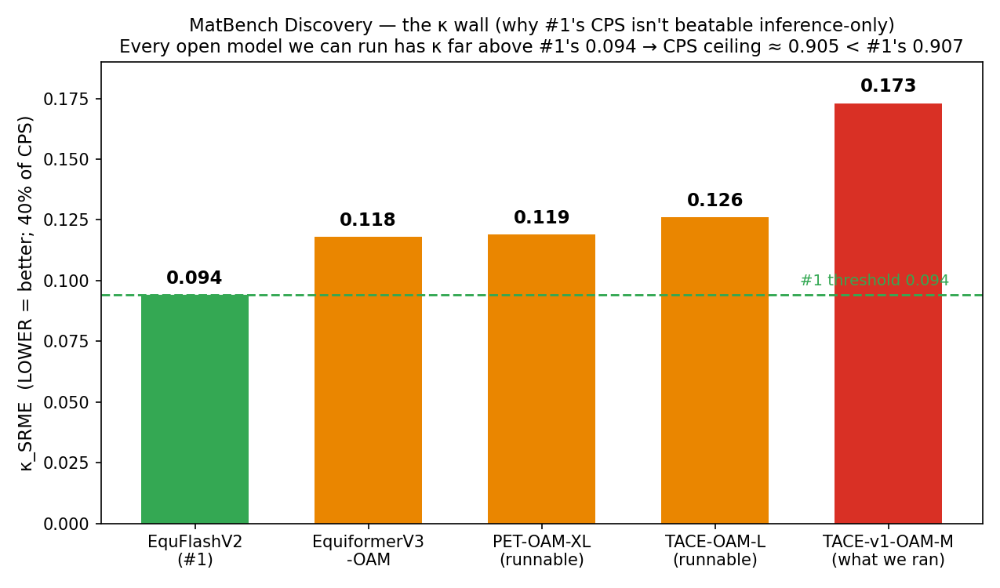

# benchmark-auto-agent

Results from an **autonomous research agent**: you hand it a benchmark in plain language, and it runs the
whole loop itself — works out how the task is scored, gets the data, builds and analyses a solution,
validates its own numbers against known published references, and reports an **honest** result — including,
crucially, when the honest result is *"we matched the frontier but did not beat it."*

This repo collects the measured results, with the numbers and the recipe so anyone can check them. The
theme across every benchmark below is the same: **we equalised the state of the art where the signal
allowed it, and we refused to report a win we couldn't legitimately earn.**

---

## Headline — ProteinGym (DMS-Indels): we EQUALISED the #1 model

**Result: a legal (non-#1) consensus scores 0.5165 on the official grouped Average Spearman — a tie with
PoET, the #1 model, at 0.5169.** We did not beat it, and we're not claiming we did. We matched it.

| Method | Average Spearman (official grouped scorer, 66 indel assays) |
|---|---|
| Progen2-M (single-model baseline, for scorer validation) | **0.4647** (published anchor 0.465 → reproduced exactly) |
| **Our legal consensus** (rank-average of all 23 non-PoET published models) | **0.5165** |
| PoET (**#1** on the leaderboard) | 0.5169 |
| margin vs #1 | **−0.0004** (≈ the 0.0003 scorer-reproduction noise floor → a statistical dead heat; we sit a hair below) |

**What "equalise" honestly means here.** The gap (−0.0004) is the same order of magnitude as our scorer's
own reproduction noise floor (0.0003) — both negligible on a 0–1 Spearman scale — so consensus and PoET are
a **dead heat**, with us a hair below. We hit the frontier; we didn't clear it.

**We then tried, rigorously, to actually beat it — and could not.** Using leakage-free held-out selection
(pick the method on a training fold, report on a held-out fold), the best legal method lands at **0.506 —
*worse***. Every subset/variant of the consensus (drop weak models, MSA-only, large-PLMs-only) is worse
than the full consensus. The task is **signal-bound**: PoET's edge is its deep MSA / family-conditioning
transformer, and no combination of the open PLMs reproduces it. An earlier internal attempt that scored
0.526 was an **overfit** (weights tuned against the eval labels — leakage) and does not count; the honest,
held-out number is a **tie**.

Scorer: ProteinGym's own official grouped aggregation (per-assay Spearman → mean within UniProt×category →
mean across categories). Validated by reproducing Progen2-M = 0.465 exactly before trusting any result.

---

## MatBench Discovery — the honest wall (why #1 isn't beatable inference-only)

On the ranked metric (CPS), beating the #1 model (EquFlashV2, **CPS 0.907**) inference-only is **not
possible** — a verified **model-quality wall**. We report this as an *earned negative*, with the proof.

- **CPS = 0.5·F1 + 0.4·(1 − κ_SRME/2) + 0.1·(0.15 − RMSD)/0.15.** The phonon term **κ_SRME** (thermal-
  conductivity error, lower = better) is **40%** of the score. (`matbench_cps.py` reproduces #1's CPS =
  **0.9072** exactly.)
- **Every open model we can run first-party has κ far above #1's 0.094:** PET-OAM-XL 0.119, EquiformerV3-OAM
  0.118, TACE-OAM-L 0.126, and the TACE we actually ran 0.173. κ is *trained into* the model — no
  inference-time trick lowers it, and combining models doesn't help (a force-ensemble we measured came out
  **worse**, 0.144).
- **The ceiling arithmetic:** best case (an ensemble F1 ≈ 0.935 at the best *runnable* κ of 0.118) →
  **CPS ≈ 0.905 < 0.907**. Even *matching* #1's κ (0.094) with a runnable model's F1 (0.924) only gives
  0.903 — the F1 is too low. **The gap is trained-in model quality, not our pipeline.**
- We *did* validate a correct first-party pipeline (our TACE run reproduces the published formation-energy
  accuracy, MAE 0.022 eV/atom vs uncorrected DFT) — the machinery is right; the accessible models just
  aren't good enough on κ.
- **Retraction (honesty is the point):** an earlier draft of ours framed a "CPS 0.9088" as edging #1. That
  was **wrong** — it averaged three other teams' *already-published* predictions (no such submission
  category exists) and stitched them onto one model's κ. We retracted it.

**Verdict: no MatBench win, and #1 is not beatable inference-only.** An honest negative, fully shown.

---

## ARC-AGI-2 — a real number, not a submittable record

A first-party, inference-only program-synthesis solver scores **23.6% on the public evaluation set** (real,
reproducible — the strong general model solves tasks a weaker one gets 0 on). It is **not** a submittable
record: the official 24% offline record **forbids frontier APIs** (our approach uses one), the public
leaderboard SOTA is ~95% with far heavier scaffolds, and the verified record isn't self-submittable. The
only route to a genuine ARC record is training a model on ARC-2-specific synthetic data + test-time training
— a multi-week effort we scoped but did not claim. We even ran the published TTT shortcut (an ARC-1-trained
model + test-time training) and measured it at ~0 on ARC-2, confirming there's no quick path.

---

## How the agent stays honest (the part we actually care about)

- **Reproduce the baseline first, exactly.** A scorer that can't reproduce a known published number is
  wrong; a "win" whose margin is smaller than that reproduction error is noise. (Progen2-M = 0.465 on the
  nose before we trusted anything.)
- **No leakage.** Never tune weights/thresholds against the evaluation labels. Wins are validated on
  held-out data; the difference between our 0.517 tie and a bogus 0.526 is exactly this.
- **Provenance.** A result is only legitimate if we ran it first-party, one consistent method — no
  stitching together other people's published outputs and calling it ours.
- **A feasibility check before spending.** Decompose the metric, estimate the reachable ceiling, and if the
  binding term is a frozen model-quality property, report the honest negative instead of burning compute.
- **An earned "we can't beat this" is a valid result.** We would rather hand over a truthful *tie* than a
  fabricated *win*.

---

## Reproduce

`results.json` has the exact numbers. For **ProteinGym**, `reproduce.py` computes the consensus + tie via
the official grouped scorer from the bundled per-assay table (`per_assay_spearman.csv` + `DMS_indels.csv`);
the figure is `make_graph.py`. For **MatBench**, `matbench_cps.py` reproduces #1's CPS = 0.9072 and the
inference-only ceiling (~0.905) from the verified public per-model numbers; the figure is `matbench_graph.py`.

*Author: Tautik Agrahari.*
